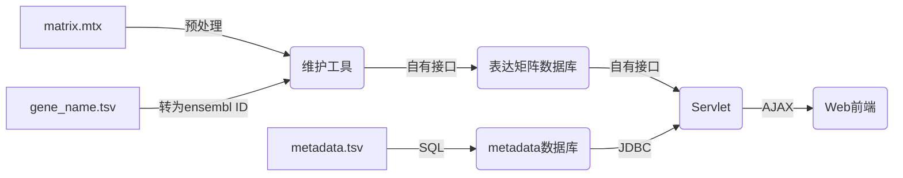

## 为什么需要本项目？
单细胞测序数据主要由**表达矩阵**和**元数据**（**metadata**）组成，表达矩阵描述了各个基因在不同细胞内的表达量，metadata则在细胞层面上对每个细胞进行描述，包含细胞所属区域、捐赠者信息等，这些信息由多人在大量的文章中收集而来，需要有组织地存放，并为用户提供访问的途径。本项目集存储、查询为一体，为用户提供了一条便捷的访问庞杂的单细胞测序数据的途径。

## 总体结构

### 数据库

本数据库将要存储**60000列以上**的浮点类型数据（表达矩阵），以及**10列左右**的字符串类型数据（metadata）。传统的关系型数据库并不支持在单张表中存储如此多的列，所以需要另辟蹊径；但是传统的关系型数据库能够存储列数很少的metadata信息。因此，目前的数据库由两部分组成：

* 由软件学院开发的基于B树（？）的数据库，存储表达矩阵，能保证相当快的插入、查询速度；

* SQLite数据库，存储metadata，支持SQL语言。

### Web前端

Web前端采用JSP+Servlet架构，实现对数据库的访问，用户可以通过各种条件对数据库中数据进行筛选。

### 维护工具

项目还有在命令行下运行的维护工具，供管理人员使用，可以对数据库内的数据进行编辑。收集到一组新数据后，经过简单的预处理，即可通过维护工具插入数据库。

## 实现细节

### 数据的标准化

在项目建设初期，收集的数据都已标准化成了表达矩阵（matrix.mtx、gene_name.tsv、cell_ID.tsv）、metadata（metadata.tsv）两部分。其中metadata.tsv在收集的时候已经做到了格式的统一，无需进一步标准化；但是不同来源的数据的基因数目不一样多，少则一万，多则五六万，且基因名的表达方式不同，大致可以分为gene symbol和ensembl ID两种。表达矩阵数据库的字段（列名）必须做到统一，所以需要制定一个方案，对表达矩阵信息进行统一。

为了标准化这些表达矩阵，并最大限度地保留信息，表达矩阵数据库的列名采用Ensembl数据库中最新版的**Human genes (GRCh38.p13)**作为标准，共有**67140**个基因，也就是说数据库共有67140列，每一列对应着Ensembl数据库中的一个基因。

目前已有R语言脚本辅助表达矩阵的标准化，实现从gene symbol到ensembl ID的转换。部分gene symbol没有对应的ensembl ID，会被弃去。

管理人员还需检查matrix.mtx，保证每一行第一个数对应cell_ID中的行数，第二个数对应gene_name中的行数。

### 数据的插入

在将表达矩阵标准化后，管理人员可以通过维护工具读取。维护工具会自动把matrix.mtx的列和数据库的列对应起来，无法对应的列会被弃去；对应完成之后，将数据逐条插入。

metadata数据量小，且SQLite支持SQL语言。管理人员可以通过SQL查询的方式逐条插入metadata记录，还可以借助图形化的工具（如Navicat），直接将tsv文件插入数据库中。

目前的维护工具是用Java语言编写的，只有一个类hcad_cli，提供了四个接口：

- ```java
  void insertMatrix()
  ```

- ```java
  void insertMetadata()
  ```

- ```java
  void queryByMatrix()
  ```

- ```java
  void queryByMetadata()
  ```

并且有三个私有静态变量：

```java
private static final int refColCount = 67140; //参考基因数
private static RangeSearcher rangeSearcher; //表达矩阵数据库对象
private static Scanner sc = new Scanner(System.in);
```

下面逐个描述其实现细节：

#### void insertMatrix()

插入矩阵的第一个难题就是将gene_name.tsv里的gene ID和数据库的列对应，因为gene_name.tsv里的gene ID的排序是混乱的。我采用了以下的解决方案：

开始时，先读取gene_name.tsv，获取其行数，也就是该矩阵中的基因数mappingCount。这主要是给mapping数组（作用后面会讲）提供开空间的依据。

```java
int mappingCount = 0;
File file = new File("gene_name.tsv");
String strLine;
BufferedReader bufferedReader = new BufferedReader(new FileReader(file));
while (null != (strLine = bufferedReader.readLine())) {
    mappingCount++;
}
```

ref.txt里有67140行，也就是67140个参考基因，也就是数据库的67140个列名。再依据ref.txt制作一张哈希表refTable，key为String类型，也就是gene ID；value为int类型，也就是该gene ID在ref.txt中的行数，亦即在数据库中的列数。

```java
int mapping[] = new int[mappingCount];
String colName[] = new String[refColCount];
double data[] = new double[refColCount];
file = new File("ref.txt");
bufferedReader = new BufferedReader(new FileReader(file));
strLine = null;
HashMap<String, Integer> refTable = new HashMap<String, Integer>();
int lineCount = 1;
while (null != (strLine = bufferedReader.readLine())) {
    refTable.put(strLine, lineCount - 1); //制作参考表
    colName[lineCount - 1] = strLine; //制作列名，注意数组下标从0开始
    if (curRow == 0) rangeSearcher.addColumn(strLine); //如果是空白数据库，则添加column（数据库的要求）
    lineCount++;
}
```

再次读取gene_name.tsv，每一行都是一个基因，把第i个基因拿到refTable中查找，如果能找到，则把返回值（数据库中的列数）存入mapping[i]；否则mapping[i]=-1，证明该基因找不到。（可能是被淘汰了，或者gene symbol转换成gene ID没有成功）

```java
file = new File("gene_name.tsv");
bufferedReader = new BufferedReader(new FileReader(file));
lineCount = 1;
while (null != (strLine = bufferedReader.readLine())) {
    if (refTable.get(strLine) != null)
        mapping[lineCount - 1] = refTable.get(strLine); //制作映射，这里的第一列对应refTable的第？列
    else mapping[lineCount - 1] = -1;
    lineCount++;
}
refTable = null; //不再使用
```

第二个难题是表达矩阵数据库的插入接口需要提供数据库已有行数作为参数。数据库本身有一个接口，能够返回现在数据库里每一行的ID，只需统计总数就能得到已有行数，但是这个接口在行数很多的时候会非常慢，甚至有导致程序崩溃的风险。所以我采用了另一个办法，用count.txt来记录：

```java
file = new File("count.txt");
bufferedReader = new BufferedReader(new FileReader(file));
int curRow = 0;
while (null != (strLine = bufferedReader.readLine())) {
    curRow = Integer.valueOf(strLine); 
}
```

第三个难题是如何将“两个细胞”区分开。因为表达矩阵是.mtx格式，只要每一行的第一个数相同，就说明这些行描述的是同一个细胞，只是描述的基因不同。这里采用的方法比较巧妙，请结合源代码理解。

注意，每1000行需要执行flush()一次，否则容易崩溃。

当然，最后需要更新count.txt：

```java
file = new File("count.txt");
BufferedWriter out = new BufferedWriter(new FileWriter(file));
out.write(String.valueOf(cellCount));
out.close();
```

#### void insertMetadata()

这一部分不需要多做解释，只是借助JDBC连接SQLite：

```java
Class.forName("org.sqlite.JDBC");// 加载驱动,连接sqlite的jdbc
Connection connection = DriverManager.getConnection("jdbc:sqlite:metadata.db");//连接数据库metadata.db
Statement statement = connection.createStatement();   //创建连接对象，是Java的一个操作数据库的重要接口
```

读取tsv部分采用的是OpenCSV：

```java
String fileName = "metadata.tsv";
InputStreamReader is = new InputStreamReader(new FileInputStream(fileName), "utf-8");
CSVParser csvParser = new CSVParserBuilder().withSeparator('\t').build();
CSVReader reader = new CSVReaderBuilder(is).withCSVParser(csvParser).build();
List<String[]> strings = reader.readAll();
```

然后逐条插入即可，正好tsv中的一行（第一行除外，那是列名），对应数据库中的一行

```java
int count=0;
for (String[] strs : strings) {
    if (count == 0) {
        //第一行是字段，不用管
    } else {
        statement.executeUpdate("INSERT INTO metadata (organ,region,subregion,sample_status,cell_ID,donor_ID,donor_gender,donor_age) " +
                "VALUES ('"+strs[0]+"','"+strs[1]+"','"+strs[2]+"','"+strs[3]+"','"+strs[4]+"','"+strs[5]+"','"+strs[6]+"','"+strs[7]+"')"); //这种SQL语句的拼接方式十分笨拙，也有能够生成SQL语句的库
    }
    count++;
}
```

最后注意要关闭数据库的连接，以及输入输出流：

```java
reader.close();
is.close();
connection.close();//关闭数据库连接
```

#### void queryByMatrix()

这是按照表达矩阵中的条件查询，用到的自然是表达矩阵数据库的接口。核心代码只有一行：

```java
Set<Long> resultSet = rangeSearcher.rangeSearch(colNames, conditions, conditionCount);
```

各个参数的意思可以顾名思义。

#### void queryByMetadata()

这是按照metadata的条件查询，用到的是SQL查询。细节不再赘述，可以参考源代码。

#### 附：RangeSearcher的接口

RangeSearcher就是表达矩阵数据库。以下内容来源于开发者：

1. 类名：

   ```java
   RangeSearcher
   ```

2. 新建：

   ```java
   RangeSearcher(String dirPath)
   ```

初始化类进行操作，dirfile为数据文件的存储目录。

3. 关闭：

   ```java
   void close()
   ```

关闭该类，释放资源。

4. 添加列：

   ```java
   void addColumn(String column)
   ```

添加一个值列，column为列名（唯一）。

5. 插入数据：

   ```java
   void insert(long ID, String[] columns, double[] values, int len)
   ```

插入一行数据。ID为行ID（唯一），columns为所有列名，values为所有列值，len为列数。

6. 查询数据：

   ```java
   Set<Long> rangeSearch(String[] columns, BasicIndexQuery[] conditions, int len)
   ```

根据筛选条件查询数据。columns为所有筛选条件的列名，values为所有筛选条件，len为筛选条件数，返回值为满足条件的列ID集合。

7. 迭代查询：

   ```java
   Set<Long> rangeSearch(String[] columns, BasicIndexQuery[] conditions, int len, Set<Long> candidates)
   ```

根据筛选条件和上一步结果迭代查询数据。columns为所有筛选条件的列名，values为所有筛选条件，len为筛选条件数，candidates为上一步查询结果，返回值为满足条件的列ID集合。

8. 删除数据：

   ```java
   void delete(long ID)
   ```

删除一行数据。ID为待删除的行ID。

早期版本的RangeSearcher在插入行数过多时会崩溃，所以又引入了void flush()接口，能及时将插入的内容存盘，大约每1000行需要运行一次。有了该接口之后，关闭程序时就不必且不能运行void close()了。

### 数据的访问

用户可以通过Web前端访问数据。前端采用JSP+Servlet架构，JSP通过AJAX与Servlet通信，依据Servlet返回的JSON来更新网页。Servlet充当后端，保障了前端对数据库的访问。Servlet通过数据库的自有接口来访问表达矩阵数据库；通过JDBC访问SQLite搭建的metadata数据库。

## 完整的工作流

### 数据的标准化

1. 检查gene_name.tsv，是否为gene ID类型。若是，则不需转换；若不是，则运行convert.r进行转换。

```R
library(biomaRt)
data<-read.csv("gene_name.tsv",header=T,stringsAsFactors = F)
data2<-data$gene_name
ensembl=useMart(biomart="ensembl",dataset="hsapiens_gene_ensembl")
res <- getBM(attributes=c("ensembl_gene_id","hgnc_symbol"),filters = c("hgnc_symbol"), values=list(data2), mart=ensembl)
converted<-character()
i=0
for(row in data$gene_name)
{
	i=i+1
	gene_ID<-res[res['hgnc_symbol']==row][1]
	if (is.na(gene_ID)) converted[i]<-"ENSG00000000000" #对应不上就不要了
	else converted[i]<-gene_ID
}
write.table(converted,file = "gene_name_out.tsv",sep='\t',col.names=FALSE,row.names=FALSE,quote=FALSE)
```

2. 检查metadata.tsv中的细胞数和matrix.mtx中的是否一致，检查gene_name.tsv中的基因数和matrix.mtx中的是否一致。

3. 检查matrix.mtx，使得每一行第一个数对应cell_ID中的行数，第二个数对应gene_name中的行数。转换工作可以用SciPy完成。


#### 数据的插入

1. 直接运行维护工具，按照提示操作。

2. 维护工具还提供了简易的查询功能。

### 数据的访问

1. 用户可通过Web界面访问数据库。
2. 管理人员可通过维护工具进行简单的查询。

## 项目现状

截至目前，项目已经有了明晰的结构，“实现细节”中的前两条已经完成，现在已经有了统一数据的方案，以及将数据录入数据库的工具。Metadata部分暂时采用SQLite，可以替换成其他关系型数据库，如MySQL；由于它们都支持SQL语言，所以代码迁移不会很复杂。

但是项目还有许多不完善地方，列举如下：

1. 在维护工具的代码中的所有语句执行完毕后，程序退出需要比较长的时间。数据库开发者解释：此现象属于正常情况。关闭的时候后台在做一些树结构整理的工作，优化结构。

2. Web前端功能不完善，目前只能根据Cell Type和Origin查询，返回饼图。我对这方面也不熟悉，现在在摸着石头过河。

3. 两个数据库的结合遇到了瓶颈，表达矩阵数据库仅支持通过几个有限的接口进行访问，不支持SQL语句，这就不能与metadata数据库实现很好地结合。在不改变两个数据库本身的前提下，目前设想的方案是依据用户提供的条件，在两个数据库内各查询一次，然后取交集。这方案看上去还可以，实际上只能算权宜之计，因为两次查询必然会影响效率，而且取交集也并不容易。

   如果用户输入了混合条件，例如若干个基因数条件和一个细胞所在器官的条件，那么就需要先在表达矩阵数据库里查找到满足基因数条件的记录行号，再在metadata数据库内找到满足器官条件的记录行号，然后取交集。如果用户仅仅需要结果中记录中的个数，那这样可能还好；如果用户需要访问满足要求的记录的metadata，就需要回过头来根据这些行号再访问数据；如果需要更多高级的操作，如根据某些列进行排序，那么就会更麻烦。这就像是用胶水把两个数据库粘在一起，并没有真正地让它们连在一起。